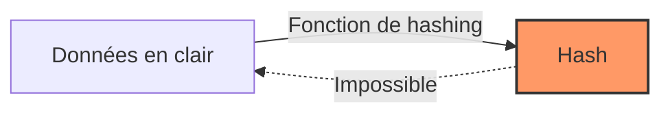

## 🎯 Objectifs de la Room

Cette room TryHackMe couvre les concepts fondamentaux du hashing en cybersécurité. Au programme :
- Comprendre ce qu'est un hash et à quoi il sert
- Identifier différents algorithmes de hashing
- Apprendre les techniques de cracking de hash
- Utiliser des outils comme hashcat et john

**Difficulté :** Easy  
**Lien :** [Hashing Basics](https://tryhackme.com/room/hashingbasics)

## 📚 Qu'est-ce qu'un Hash ?

Un hash est une fonction mathématique qui transforme des données de taille variable en une empreinte de taille fixe. Les caractéristiques principales :

- **Déterministe** : La même entrée produit toujours le même hash
- **Irréversible** : Impossible de retrouver l'entrée originale à partir du hash
- **Unique** : Deux entrées différentes produisent (théoriquement) des hash différents
- **Rapide** : Le calcul doit être efficace



## 🔍 Types de Hash Courants

### MD5 (Message Digest 5)

```bash
# Exemple de hash MD5
echo -n "password" | md5sum
# Output: 5f4dcc3b5aa765d61d8327deb882cf99
```

**Caractéristiques :**
- 128 bits (32 caractères hexadécimaux)
- ⚠️ **Obsolète et vulnérable** aux collisions
- Ne devrait plus être utilisé en production

### SHA-256 (Secure Hash Algorithm)

```bash
# Exemple de hash SHA-256
echo -n "password" | sha256sum
# Output: 5e884898da28047151d0e56f8dc6292773603d0d6aabbdd62a11ef721d1542d8
```

**Caractéristiques :**
- 256 bits (64 caractères hexadécimaux)
- ✅ Actuellement sécurisé
- Utilisé dans Bitcoin et de nombreuses applications

### Bcrypt

```bash
# Hash bcrypt (exemple)
$2b$12$KIXxkM5FZrLQKxZqzLQjQe7ZqEQzGJYvBTlWqLqbJqYQj8gqKJqKq
```

**Caractéristiques :**
- Spécialement conçu pour les mots de passe
- Inclut un "salt" automatique
- Coût computationnel ajustable (protection contre brute-force)

## 🔨 Identifier un Hash

### Utiliser hash-identifier

```bash
# Installation
sudo apt install hash-identifier

# Utilisation
hash-identifier
# Puis coller votre hash
```

### Utiliser hashid

```bash
# Installation
pip install hashid

# Utilisation
hashid '5f4dcc3b5aa765d61d8327deb882cf99'
```

### Reconnaissance manuelle

| Type | Longueur | Format | Exemple |
|------|----------|--------|---------|
| MD5 | 32 chars | hex | `5f4dcc3b5aa765d61d8327deb882cf99` |
| SHA-1 | 40 chars | hex | `5baa61e4c9b93f3f0682250b6cf8331b7ee68fd8` |
| SHA-256 | 64 chars | hex | `5e884898da280471...` |
| bcrypt | ~60 chars | `$2[aby]$...` | `$2b$12$...` |

## 💥 Cracking de Hash

### Task 1 : Crack un hash MD5

**Hash fourni :**
```
5f4dcc3b5aa765d61d8327deb882cf99
```

**Méthode 1 : Recherche en ligne**

Utiliser [CrackStation](https://crackstation.net/) ou [MD5Decrypt](https://md5decrypt.net/)

**Méthode 2 : Hashcat**

```bash
# Sauvegarder le hash
echo "5f4dcc3b5aa765d61d8327deb882cf99" > hash.txt

# Cracker avec wordlist rockyou
hashcat -m 0 -a 0 hash.txt /usr/share/wordlists/rockyou.txt

# -m 0 = MD5
# -a 0 = mode dictionnaire
```

**Méthode 3 : John the Ripper**

```bash
# Identifier le format
john --format=raw-md5 hash.txt

# Cracker
john --wordlist=/usr/share/wordlists/rockyou.txt --format=raw-md5 hash.txt

# Afficher le résultat
john --show hash.txt
```

**Réponse :** `password`
{: .filepath}

### Task 2 : Hash avec Salt

Un salt est une valeur aléatoire ajoutée avant le hashing pour empêcher les attaques par tables précalculées.

```python
import hashlib

password = "admin"
salt = "random_salt_123"
combined = password + salt

hash_result = hashlib.sha256(combined.encode()).hexdigest()
print(f"Hash: {hash_result}")
```

> Le même mot de passe avec des salts différents produira des hash complètement différents !
{: .prompt-tip }

### Task 3 : Attaque par Brute Force

```bash
# Générer tous les mots de passe possibles de 4 caractères
hashcat -m 0 -a 3 hash.txt ?l?l?l?l

# ?l = lowercase letter
# ?u = uppercase letter
# ?d = digit
# ?s = special character
```

**Exemple de masques :**
- `?d?d?d?d` : 4 chiffres (PIN)
- `?u?l?l?l?d?d` : Majuscule + 3 minuscules + 2 chiffres
- `?a?a?a?a?a?a` : 6 caractères quelconques

## 🛡️ Bonnes Pratiques

### Pour le Stockage de Mots de Passe

1. ✅ **Utiliser bcrypt, scrypt, ou Argon2**
2. ✅ **Toujours utiliser un salt unique par utilisateur**
3. ✅ **Ne jamais stocker les mots de passe en clair**
4. ❌ **Ne pas utiliser MD5 ou SHA-1**

### Pour les Développeurs

```python
# Exemple avec bcrypt en Python
import bcrypt

# Hashing
password = b"super_secret_password"
hashed = bcrypt.hashpw(password, bcrypt.gensalt())

# Vérification
if bcrypt.checkpw(password, hashed):
    print("Mot de passe correct!")
```

### Pour les Pentesteurs

```bash
# Extraire les hash de /etc/shadow
sudo cat /etc/shadow | grep username

# Format : username:$algorithm$salt$hash
# $1$ = MD5
# $5$ = SHA-256
# $6$ = SHA-512
# $y$ = yescrypt
```

## 📊 Comparaison des Performances

| Algorithme | Vitesse | Sécurité | Usage recommandé |
|------------|---------|----------|------------------|
| MD5 | ⚡⚡⚡ | ❌ | Checksums uniquement |
| SHA-1 | ⚡⚡⚡ | ⚠️ | Obsolète |
| SHA-256 | ⚡⚡ | ✅ | Intégrité de données |
| bcrypt | ⚡ | ✅✅✅ | Mots de passe |
| Argon2 | ⚡ | ✅✅✅✅ | Mots de passe (meilleur) |

## 🔗 Outils et Ressources

### Outils de Cracking

- **Hashcat** : [hashcat.net](https://hashcat.net/hashcat/)
- **John the Ripper** : [openwall.com](https://www.openwall.com/john/)
- **CrackStation** : Lookup en ligne

### Wordlists

```bash
# Rockyou (14M de mots de passe)
/usr/share/wordlists/rockyou.txt

# SecLists
git clone https://github.com/danielmiessler/SecLists
```

### Documentation

- [OWASP Password Storage Cheat Sheet](https://cheatsheetsec.com/passwords/)
- [Hashcat Wiki](https://hashcat.net/wiki/)

## 🎓 Ce que j'ai Appris

1. **Différence entre hashing et encryption** : Le hashing est à sens unique, impossible à inverser
2. **Importance du salt** : Protège contre les rainbow tables et les attaques précalculées
3. **Choix de l'algorithme** : Utiliser des algorithmes modernes adaptés au contexte
4. **Techniques de cracking** : Dictionnaire, brute-force, règles de mutation
5. **Sécurité des mots de passe** : Longueur + complexité + algorithme fort = sécurité

## 🏁 Conclusion

Cette room est une excellente introduction au hashing pour les débutants en cybersécurité. Elle couvre les concepts essentiels et les outils de base que tout pentester doit connaître.

**Points clés à retenir :**
- Les hash ne sont PAS du chiffrement
- MD5 et SHA-1 sont obsolètes pour la sécurité
- Toujours utiliser un salt pour les mots de passe
- Bcrypt/Argon2 sont les standards actuels

> La prochaine étape : explorer les attaques avancées avec hashcat et les règles de mutation !
{: .prompt-info }

---

**Room complétée** ✅  
**Difficulté ressentie :** Easy  
**Temps passé :** ~45 minutes